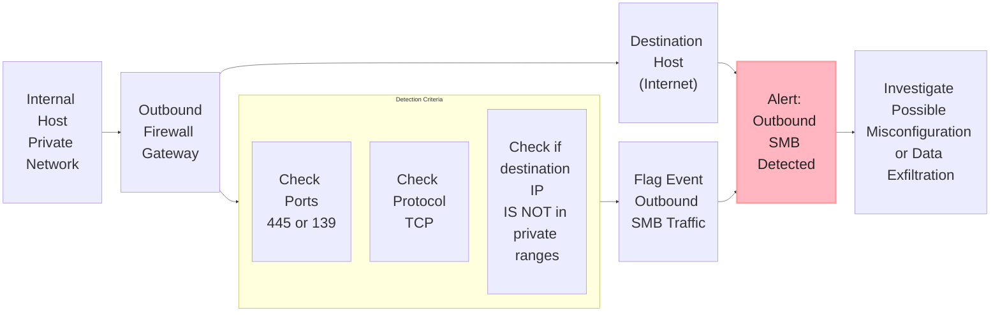
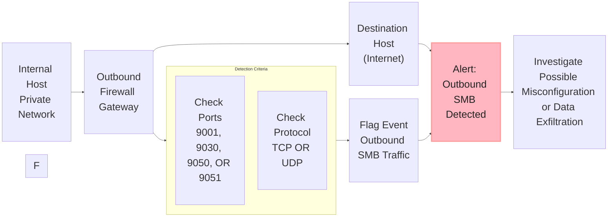

| Use Case | Pattern | Description |
|----------|---------|-------------|
| Outbound SMB Traffic Detection | Destination port matches 445 or 139. | Detects attempts to access SMB services over the internet, which may indicate misconfigurations or data exfiltration. (**MITRE: T1021.002** – Remote Services: SMB/Windows Admin Shares) |
| Suspicious Traffic on TOR Port | Destination port matches 9001, 9030, 9050, or 9051. | Identifies potential TOR usage by flagging traffic to common TOR relay or entry ports. **(MITRE: T1090.003 – Proxy: Multi-hop Proxy)** |
| Traffic to Suspicious Countries | Derived country by IP matches 'Russia', 'Iran', 'North Korea', or 'China' | Flags outbound connections to high-risk geolocations which may indicate C2 traffic or exfiltration. **(MITRE: T1589 – Gather Victim Identity Information)** |
| Network Device Password Spraying | Destination port matches 22, 23, 443, 161, or 80 with pattern='deny' where the count by IP is greater than FIVE | Detects repeated failed authentication attempts across multiple network devices, consistent with password spraying. **(MITRE: T1110.003 – Password Spraying)** |
| High Volume Traffic from a Single IP  | Destination port matches 22, 23, 443, 161, or 80 and the count by IP is excessively high over a period of ONE minute | Identifies excessive traffic volume from a single host, possibly indicating scanning, malware, or exfiltration. **(MITRE: T1030 – Data Transfer Size Limits)** |
| Detect Outbound LDAP Traffic              | Destination port matches 389, or 636. | Detects LDAP and LDAPS traffic leaving the internal network, which is typically abnormal and may indicate data leakage. **(MITRE: T1136.003 – Create Account: Cloud Account)** |
| Anomalous Connection Pattern: Single Source to Multiple Users | Count how many IPs associate with a single source IP. | Flags scanning or worm-like propagation from a single internal source to multiple internal hosts. **(MITRE: T1021 – Remote Services)** |

---

## **Outbound SMB Traffic Detection**

Detects attempts to access SMB services over the internet, which may indicate misconfigurations or data exfiltration. This detection aligns with [MITRE: T1021.002](https://attack.mitre.org/techniques/T1021/002) – Adversaries may use **valid accounts** to interact with a remote network share using Server Message Block (SMB). The adversary may then perform actions as the logged-on user.



Detection logic using standard search with filtering.
```sql
dataSource.name = 'Cisco Meraki MX Firewall' 
dst.port.number in (445, 139) 
connection_info.protocol_name = "tcp" 
NOT (dst.ip.address matches ("10.0", "192.", "172."))
```

> PowerQuery

This is ideal for a report.

```sql
dataSource.name = 'Cisco Meraki MX Firewall' 
dst.port.number in (445, 139) 
connection_info.protocol_name = "tcp" 
NOT (dst.ip.address matches ("10.0", "192.", "172."))
| group count = count() by src.ip.address, dst.ip.address
| let country = geo_ip_country(dst.ip.address)
| sort - count
```

This PowerQuery is ideal to exclude detail already understood about safe locations. For instance, the following extended search excludes for well understood traffic within Canada, but it also excludes exchanges to the `AWS us-east-1` region in Virginia.
```sql
dataSource.name = 'Cisco Meraki MX Firewall' 
dst.port.number in (445, 139) 
connection_info.protocol_name = "tcp" 
NOT (dst.ip.address matches ("10.0", "192.", "172."))
| group count = count() by src.ip.address, dst.ip.address
| let country = geo_ip_country(dst.ip.address)
| let state = geo_ip_state(dst.ip.address)
| let city = geo_ip_city(dst.ip.address)
| filter NOT (country in ('Canada'))
| filter NOT (state in ('Virginia'))
| sort - count
```

Detects SMB traffic leaving the network perimeter (often a sign of misconfiguration or worm activity).

---

## **Suspicious Traffic on TOR Port**

Identifies potential TOR usage by flagging traffic to common TOR relay or entry ports. [MITRE: T1090.003](https://attack.mitre.org/techniques/T1090/003) – Proxy: Multi-hop Proxy. Adversaries may chain together multiple proxies to disguise the source of malicious traffic. Typically, a defender will be able to identify the last proxy traffic traversed before it enters their network; the defender may or may not be able to identify any previous proxies before the last-hop proxy.



```sql
dataSource.name = 'Cisco Meraki MX Firewall' 
dst.port.number in (9001, 9030, 9050, 9051)
connection_info.protocol_name in ("tcp", "udp")
```

> PowerQuery 

```sql
dataSource.name = 'Cisco Meraki MX Firewall' 
dst.port.number in (9001, 9030, 9050, 9051)
connection_info.protocol_name in ("tcp", "udp")
| group count = count() by src.ip.address, dst.ip.address, dst.port.number
| group dest_ips = array_agg_distinct(dst.ip.address) by src.ip.address, string(dst.port.number)
| let len = len(dest_ips) 
| sort - len
```

Flags outbound connections to common TOR entry or relay ports.

---

## **Traffic to Suspicious Countries**

> PowerQuery

```sql
dataSource.name = 'Cisco Meraki MX Firewall' 
| let dst.geo.country = geo_ip_country(dst.ip.address)
| filter dst.geo.country in ("Russia", "Iran", "North Korea", "China", "Syria")
| filter connection_info.protocol_name in ("tcp", "udp")
| group count = count() by device.hostname, src.ip.address, dst.ip.address, dst.geo.country, connection_info.protocol_name, dst.port.number 
```
Detects communications with high-risk geolocations.

> Note: Requires enrichment of `dst.geo.country`. 


---

## **Network Device Password Spraying**
```sql
dataSource.name = 'Cisco Meraki MX Firewall' 
event.type = 'firewall' 
dst.port.number in (22, 23, 443, 161, 80) 
event.network.connectionStatus = 'deny all'
```
Detects attempts to brute-force or spray credentials across network gear (via SSH, Telnet, SNMP, etc.).

---

## **High Volume Traffic from a Single IP**

> PowerQuery

```sql
dataSource.name = 'Cisco Meraki MX Firewall' 
NOT (dst.port.number in (22, 23, 443, 161, 80))
| group count = count() by src.ip.address, dst.ip.address, timestamp = timebucket('10m')
| sort - count
```

Identifies hosts generating excessive network activity, possibly due to scanning, malware, or exfiltration.

---

## **Detect Outbound LDAP Traffic**
```sql
dataSource.name = 'Cisco Meraki MX Firewall'
dst.port.number in (389, 636)
connection_info.protocol_name = "tcp"
NOT (dst.ip.address matches ("10.0", "192.", "172."))
```
---
> PowerQuery

```sql
dataSource.name = 'Cisco Meraki MX Firewall'
dst.port.number in (389, 636)
connection_info.protocol_name = "tcp"
NOT (dst.ip.address matches ("10.0", "192.", "172"))
| let dst.geo.country = geo_ip_country(dst.ip.address)
| group count = count() by src.ip.address, dst.geo.country, dst.ip.address
```

LDAP should rarely leave the network perimeter.

---

## **Anomalous Connection Pattern: Single Source to Multiple Users**
```sql
dataSource.name = 'Cisco Meraki MX Firewall' event.type = 'firewall' 
| group count = count() by src.ip.address, dst.ip.address
| group sum = sum(count), destinations = array_agg_distinct(dst.ip.address) by src.ip.address
| let number_of_targets = len(destinations)
| sort - sum

```
> Common ≠ Safe: Attackers often hide malicious traffic behind common ports (e.g., data exfiltration over 443 or DNS tunneling on 53).

Flags scanning or malware propagation behavior.

