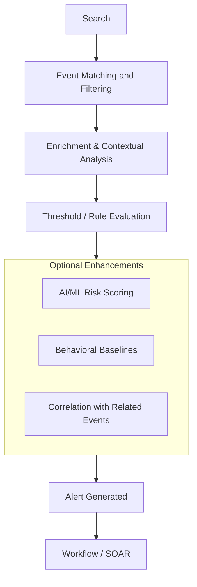

# Introduction

For SOC analysts and security engineers, **detections are the operational heartbeat** of an AI-powered SIEM. They serve as the translation layer between raw event data and meaningful security insights, helping teams identify and respond to malicious activity, policy violations, and abnormal behavior in near real time.

In an AI SIEM, detections are more than static rules — they are **dynamic signals** that leverage log correlation, statistical baselines, and machine learning to uncover:
- **Behavioral anomalies** (e.g., a user authenticating from two continents within minutes)
- **Threat actor techniques** (mapped to frameworks like MITRE ATT&CK)
- **High-risk lateral movement** and exfiltration attempts
- **Credential-based attacks** like password spraying or service abuse

Unlike traditional SIEMs, an AI SIEM can **automate signal enrichment**, reduce false positives, and prioritize alerts based on contextual risk scoring — freeing analysts from alert fatigue and allowing focus on triage, investigation, and remediation.

With structured detections in place, SOC teams can:
- **Harden detection coverage** across kill chain phases
- **Improve threat visibility across hybrid environments**
- **Continuously adapt** to evolving TTPs using AI-driven anomaly modeling
- **Accelerate incident response** through automation and real-time scoring

The result is a detection framework that’s **scalable, adaptive, and operationally aligned** — built to give defenders the upper hand in increasingly complex threat environments.

# Logic

In a modern Security Operations Center (SOC), the ability to detect threats quickly and accurately is essential. As organizations deal with increasingly complex environments and sophisticated adversaries, the detection process must incorporate dynamic, context-aware logic.

This diagram is intended to help SOC analysts, detection engineers, and security architects understand:

* How detection logic is executed

* Where decision points occur in the data pipeline

* How enrichment improves the quality and precision of alerts

* Where automated responses take effect in the chain of events

---

### 1. **Search Initiated**

The detection process begins when a search is triggered. This may happen in several ways:
- Automatically, based on a scheduled detection rule
- Manually, through an analyst-driven search
- Dynamically, from a live data stream during ingestion

At this stage, the system prepares to evaluate events against predefined detection logic.

---

### 2. **Query Executed**

The SIEM parses the detection logic into a structured query. This query is typically built using normalized event fields and includes:
- Conditions based on IP addresses, ports, users, and protocols
- Temporal logic (e.g., counts within a time window)
- Filters for event types (e.g., logon failures, file access, network activity)

This query is run against indexed data or real-time streams, depending on the platform’s architecture.

---

### 3. **Event Matching and Filtering**

The system evaluates incoming or stored events against the query. During this step:
- Irrelevant events are excluded from further processing
- Matching records are grouped or aggregated if the rule requires it (e.g., `count(distinct dst.ip.address)`)
- Detection conditions (e.g., thresholds, rare patterns) are applied

This ensures only relevant security signals proceed to the next stage.

---

### 4. **Enrichment and Contextual Analysis**

Matched events are enriched to provide context and reduce ambiguity. This may include:
- Mapping IPs to users or devices via asset inventory or identity providers
- Applying threat intelligence (e.g., known bad hosts, file hashes)
- Adding geolocation, business unit, or risk scoring to prioritize results

Enrichment enables better decision-making by attaching meaning to otherwise raw telemetry.

---

### 5. **Threshold and Rule Evaluation**

The enriched data is then evaluated against rule-specific criteria. This often includes:
- Numerical thresholds (e.g., more than 10 failures from the same IP)
- Behavior signatures (e.g., scanning, lateral movement)
- Logical conditions (e.g., failed login followed by success from a different location)

If all rule conditions are met, the detection moves to alert generation.

---

### 6. **Alert Generated**

An alert is created to represent a potential security issue. This alert includes:
- The matched events and context
- Relevant metadata (severity, tags, rule name)
- Suggested classification (e.g., brute-force, exfiltration, policy violation)

Alerts are designed to be actionable and traceable back to the detection rule that produced them.

---

### 7. **Alert Routed to Workflow or SOAR**

Finally, the alert is forwarded to one or more downstream systems:
- A case management system (e.g., for triage)
- A SOAR platform (for automated response or enrichment)
- Dashboards or ticketing systems (for tracking and escalation)

This allows the SOC team to take appropriate action—whether manual investigation, containment, or automated remediation.